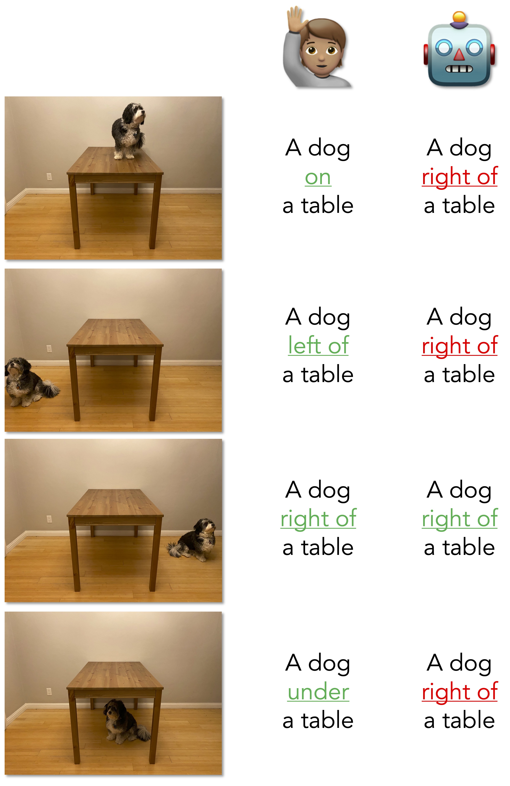
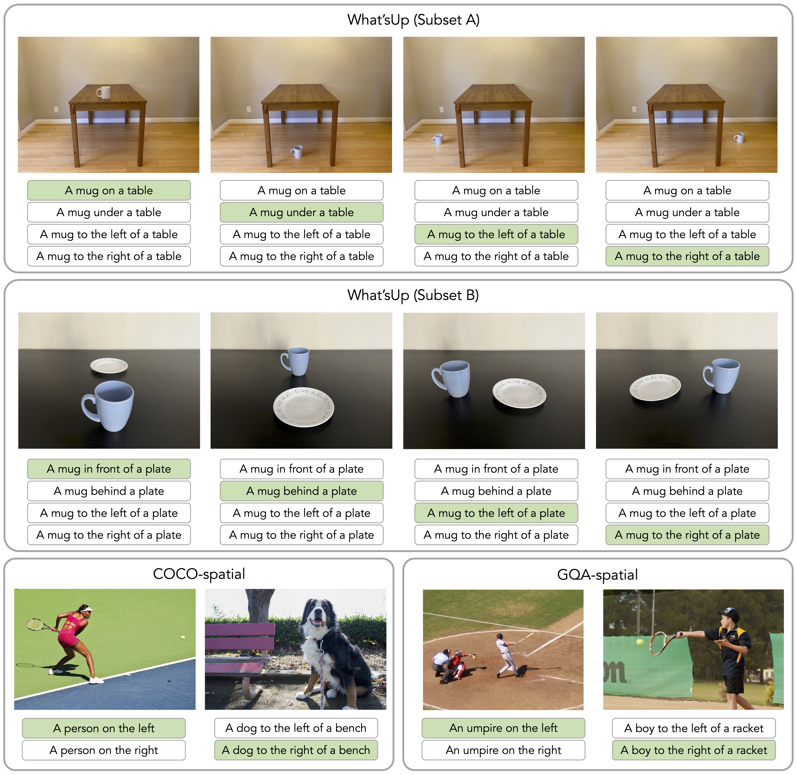

# What's "up" with vision-language models? Investigating their struggle with spatial reasoning (EMNLP 2023)

Code and datasets for "What’s “up” with vision-language models? Investigating their struggle with spatial reasoning". Our camera-ready copy is [here](https://aclanthology.org/2023.emnlp-main.568/). 

This code is based on the code for the incredibly cool ICLR 2023 paper by Yuksekgonul et al, **When and why vision-language models behave like bags-of-words, and what to do about it?** [[paper](https://openreview.net/pdf?id=KRLUvxh8uaX)][[code](https://github.com/mertyg/vision-language-models-are-bows)]. A huge shout-out to Mert Yuksekgonul, for being incredibly helpful and responsive!

**Note:** I apologize for the delay in uploading the code and data, but thank you for your interest in our work! Please feel free to leave a GitHub issue or shoot me an email at [kamatha@cs.ucla.edu](mailto:kamatha@cs.ucla.edu) if you have any questions about the code+data, or if you'd just like to chat about this (or related) work!

<p align="center">

</p>

Here's more information about the data, followed by instructions about how to use this repository to reproduce our results in the paper. 

# Datasets
Each dataset is in a separate JSON file. The JSON files consist of the image ID (or filepath to the image) and the list of caption options, where ***the first option is always the correct one***. The code to load and evaluate each dataset in `dataset_zoo/aro_datasets.py` takes care of the small differences in how they are represented in the JSONs.

<p align="center">

</p>

# Reproducing the results
## Setting Up
Clone the repository and create the `data` directory within it, where your data and models will live. Also create the `outputs` directory, where the results of each experiment will go.
Then create and activate a new conda environment and install the packages you'll need.
```
git clone https://github.com/amitakamath/whatsup_vlms.git
cd whatsup_vlms
mkdir data
mkdir outputs
conda create --name whatsup
conda activate whatsup
pip install -r requirements.txt
```

## Downloading the data
The data all lives in `whatsup_vlms/data`, which is also where your models will go as they're downloaded. You can change this in `dataset_zoo/constants.py` and `model_zoo/constants.py`, if you're so inclined.  

For all the datasets, setting `--download=True` (while running `python main_aro.py` or while instantiating the dataset directly, as mentioned later in this README) will download the data JSONs and images if the files don't already exist.

You can also download the data directly from [this Google Drive link](https://drive.google.com/drive/u/3/folders/164q6X9hrvP-QYpi3ioSnfMuyHpG5oRkZ).

**Note:** As mentioned earlier, in all the datasets in our work (`Controlled_Images_A`, `Controlled_Images_B`, `COCO_QA_one_obj`, `COCO_QA_two_obj`, `VG_QA_one_obj`, `VG_QA_two_obj`), the first caption option is always the correct one. However, of the datasets that were already in the repository (`VG_Relation`, `VG_Attribution`, `COCO_Order`, `Flickr30k_Order`), in the first two of these, the second caption is correct, and in the next two of these, the first caption is correct. This is all handled by the evaluation code, so you don't have to worry about it; this is just for your reference, if you do choose to experiment with those datasets here (although I'd recommend switching back to the [original repository](https://github.com/mertyg/vision-language-models-are-bows)). 

## Running experiments with the models in the repo
This repository contains wrappers for several models (listed later in this section). You can run experiments with any of these models on any of the datasets in the repository to reproduce the paper results, or alternately write a wrapper for a new model and see how it does on our balanced spatial reasoning task. 

To get the results of `model_name` on `dataset_name`, run the following command (add `--download=True` if you don't already have the data):
```
python main_aro.py --dataset=$dataset --model-name=$model_name
```
This will return the individual accuracy, as well as per-pair and per-set where applicable, i.e. the numbers in Table 3 of the paper. You can also run `marginalization.py` for the marginalization experiments in the paper (although they didn't yield much of an improvement). Table 1 in the paper reports macro-averages of subsets of each dataset: Controlled-A and Controlled-B, COCO/GQA one- and two-object. 

We currently support [OpenAI CLIP](https://github.com/openai/CLIP) models, [LAION OpenCLIP](https://github.com/mlfoundations/open_clip) models, [NegCLIP](https://github.com/mertyg/vision-language-models-are-bows), [CoCa](https://arxiv.org/abs/2205.01917), [XVLM](https://github.com/zengyan-97/X-VLM), [BLIP](https://github.com/salesforce/BLIP), [FLAVA](https://huggingface.co/facebook/flava-full), as well as finetuned versions of some of these on captioning/retrieval, as discussed in the paper. Here are the corresponding `model_name` values you would use in the command: 
```
openai-clip:ViT-B/32
openai-clip:ViT-L/14
NegCLIP
laion-clip:roberta-ViT-B/32
coca
xvlm-pretrained-4m
xvlm-pretrained-16m
blip-base-14m
blip-base-129m
flava
coca-cap
xvlm-flickr
xvlm-coco
blip-flickr-base
blip-coco-base
```


## Loading datasets directly
If you're using a model not in this repository and you don't want to write a wrapper to squeeze it in (although I would recommend, it would allow you to avail all the coolness of Yuksekgonul et al.'s code!), you can load the datasets directly to work with whatever model you'd like to use. 

That would look like this (code based on Yuksekgonul et al's repo, again):
```python
import clip
from dataset_zoo import Controlled_Images

model, image_preprocess = clip.load("ViT-B/32", device="cuda")

root_dir="data"
controlled_a = Controlled_Images(image_preprocess=image_preprocess, subset="A", download=True)  # Remove the download flag if you already have the data
controlled_b = Controlled_Images(image_preprocess=image_preprocess, subset="B", download=True)

# Do anything with the dataset. Each item will look like this : 
# item = {"image_options": [image], "caption_options": [true_caption, false_caption_1, ...]}
```

## Note about additional files
I'm leaving in the code from Yuksekgonul et al. that I don't directly use in my work, e.g. `main_retrieval.py`, in the belief that this would still be helpful to have around, in case you want to run the other code on the datasets I've added in.

# Citation
If you use this code or data, please consider citing our paper:
```
@inproceedings{
  kamath2023whatsup,
  title={What's ``up'' with vision-language models? Investigating their struggle with spatial reasoning},
  author={Kamath, Amita and Hessel, Jack and Chang, Kai-Wei},
  booktitle={EMNLP},
  year={2023}
}
```
